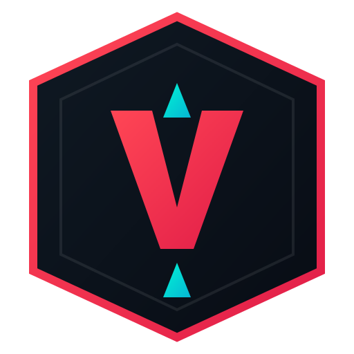

<div align="center">

  

  # ⚡ Spike Worth (Valorant Financial & Valuation Intelligence)
  
  **Yapay Zekâ Destekli Valorant Hesap Ekspertizi, Turso LibSQL Destekli 7/24 Kesintisiz Pazaryeri ve Gece Pazarı Platformu**

  [](https://nextjs.org)
  [](https://react.dev)
  [](https://www.typescriptlang.org)
  [](https://tailwindcss.com)
  [](https://turso.tech)
  [](LICENSE)

</div>

---

## 🌟 Öne Çıkan Özellikler

### 1. 🧠 Akıllı Valorant Hesap Değerleme Laboratuvarı (`/calculate`)
- **Güncel VP & ₺ / USD Çevirisi**: Güncel Valorant Points kurları üzerinden brüt harcanan para ile 2. el piyasa amortisman katsayısını hesaplar.
- **Sınırlı & Nadir Koleksiyon Primi**: *Champions 2021-2024*, *VCT Lock In*, *Arcane Sheriff*, *Ignite Fan* gibi bir daha asla mağazaya gelmeyecek eşyalara özel ekstra nadirlik çarpanı.
- **Oyuncu Arketipi Rozeti**: *💎 Okyanus Balinası*, *⚡ Radyant Gladyatörü*, *🎨 Cephanelik Ustası*.
- **VIP Ekspertiz Raporu**: Sosyal medyada (Instagram Story / Twitter / Discord) paylaşılabilir hologramik değerleme kartı.

### 2. 🛍️ 7/24 Kesintisiz Turso LibSQL Pazaryeri (`/marketplace`)
- **Asla Uyku Moduna Geçmez**: Turso LibSQL Edge veritabanı sayesinde 7/24 kesintisiz, sıfır gecikmeli veri akışı.
- **Detaylı Filtreleme**: Rank, fiyat aralığı, seviye ve skin adı araması.
- **Doğrudan İlan Verme**: Kullanıcılar hesaplarını tek tıkla veritabanına ekleyebilir.

### 3. 🃏 Gece Pazarı Simülatörü (`/nightmarket`)
- 6 gizemli kartı 3D animasyonla çevirerek şansınıza çıkan indirimli skin tekliflerini keşfedin.

### 4. 📚 Valorant Skin Cephaneliği (`/skins`)
- Valorant API ile tam senkronize tüm silah ve bıçak kaplamalarının güncel fiyat ve aşama kataloğu.

---

## 🗄️ Turso Veritabanı Kurulumu (İsteğe Bağlı)

Proje hiçbir veritabanı anahtarı girilmediğinde bile **akıllı seed sistemi** ile anında çalışır. Kendi Turso veritabanınızı bağlamak için:

1. [Turso](https://turso.tech) üzerinde ücretsiz bir veritabanı oluşturun.
2. `.env.local` dosyanıza anahtarları ekleyin:
```env
TURSO_DATABASE_URL=libsql://your-db-name.turso.io
TURSO_AUTH_TOKEN=your-auth-token
```
*(Tablolar ilk çalıştırmada otomatik olarak oluşturulur).*

---

## 🚀 Yerel Kurulum & Çalıştırma

```bash
# Repoyu klonlayın
git clone https://github.com/resulaykan/spike-worth.git
cd spike-worth

# Bağımlılıkları yükleyin
npm install

# Geliştirme sunucusunu başlatın
npm run dev
```

Tarayıcınızda [http://localhost:3000](http://localhost:3000) adresini açın.

---

## 🛠️ Teknoloji Yığını

- **Framework**: Next.js 16 (App Router & Turbopack)
- **Kütüphaneler**: React 19, Framer Motion, Lucide React, Canvas Confetti
- **Veritabanı**: Turso (LibSQL Edge Client)
- **Stil**: Tailwind CSS v4
- **API**: Valorant Official Community API

---

## 📄 Lisans

Bu proje **[MIT Lisansı](LICENSE)** ile lisanslanmıştır.

---

<div align="center">
  Geliştirici: <strong>Resul Aykan</strong> • <a href="https://github.com/resulaykan">@resulaykan</a>
</div>
